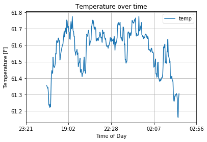

# ESP 8266 AWS IoT Temperature Sensor

This is a companion codebase to [this](https://medium.com/dan-on-coding/building-an-iot-thermostat-with-esp8266-python-and-aws-6b0555326dbe) medium article.

This project creates an IoT Temperature sensor sending data to AWS for processing. In the end it produces a graph like this:

## Prerequisites

### Hardware

All hardware components necessary for this project add up to around $30. 

- ESP8266 NodeMCU or ESP32 board ~$6 [example](https://www.amazon.com/HiLetgo-Internet-Development-Wireless-Micropython/dp/B010O1G1ES)

- 10k Ohm Thermistor ~$7/20pcs [example](https://www.amazon.com/uxcell-Thermistors-Resistors-Temperature-Sensors/dp/B07P5QC26X)

- 10k Ohm Resistor ~$6/100pcs [example](https://www.amazon.com/EDGELEC-Resistor-Tolerance-Multiple-Resistance/dp/B07QJB31M7)

- Breadboard ~$6/6pcs [example](https://www.amazon.com/MCIGICM-6PCS-tie-Points-Breadboard-Arduino/dp/B07PZXD69L)

- 1 x M-M jumper wire. ~$7 They only sell packs, like [this](https://www.amazon.com/EDGELEC-Breadboard-Optional-Assorted-Multicolored/dp/B07GD1XFWV) one.

- (optional) USB Battery Pack ~$11 [example](https://www.amazon.com/Poweradd-Slim-Ultra-compact-Portable-External/dp/B00MWU1GGI)

### Software

- Python 3.x
- terraform
- AWS account